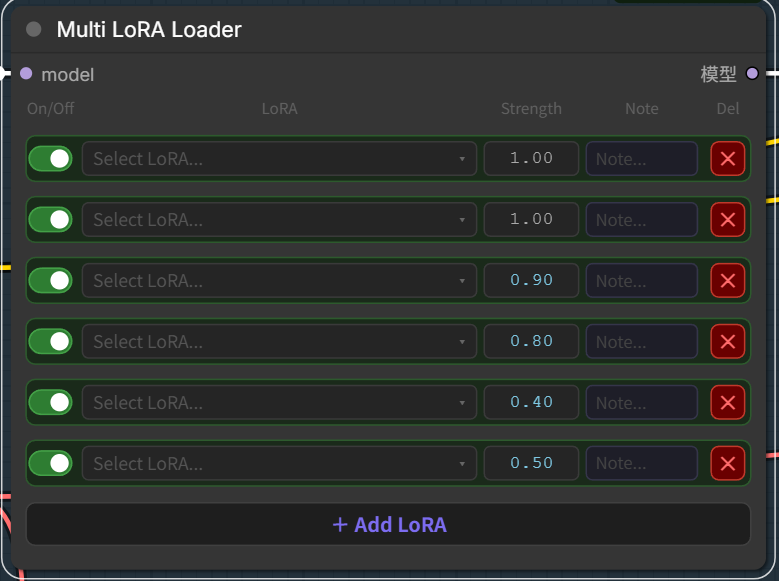

# ComfyUI-Multi-Lora
<<<<<<< HEAD

A ComfyUI custom node for managing multiple LoRAs in a single node.



## Features

- Enable/disable each LoRA with a toggle switch
- Adjust weight per LoRA
- Add notes to each LoRA
- Add/remove LoRAs dynamically

## Installation

Clone into your ComfyUI custom_nodes folder:

```bash
cd ComfyUI/custom_nodes
git clone https://github.com/Danchi/ComfyUI-Multi-Lora

Restart ComfyUI.

Usage
Add the Multi LoRA Loader node in your workflow. Connect the model and clip inputs, then use the output as you would a standard LoRA Loader.
=======
A multi LoRA loader node for ComfyUI
>>>>>>> 79e19da2ce7e4fac9b63f16a103a8f79c74701a3
